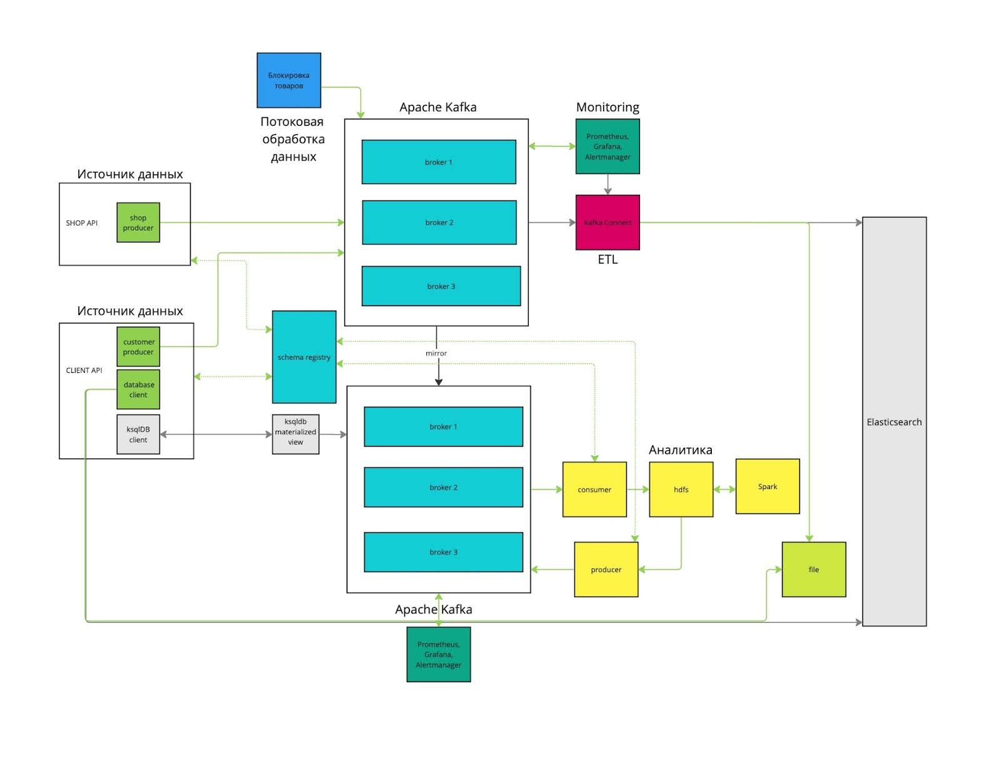

# Проект 6-го спринта


[](http://localhost:9090)
[](http://localhost:3000)


### Описание
Репозиторий предназначен для сдачи проекта 6-го спринта

### Бизнес-контекст
**«Покупай выгодно»** – платформа электронной коммерции. Ближайшая цель маркетплейса – улучшить клиентский опыт и оптимизировать бизнес-процессы. Для этого команда хочет внедрить аналитическую платформу, которая будет:
- Собирать данные о взаимодействии клиентов с сайтом (просмотры товаров, добавление в корзину, покупки и отзывы)
- Обрабатывать информацию алгоритмами машинного обучения для выявления паттернов поведения и предпочтений
- Формировать персонализированные рекомендации и релевантную рекламу
- Оптимизировать ассортимент товаров и качество обслуживания

**Ожидаемые результаты:**
- Повышение уровня удовлетворённости клиентов
- Увеличение конверсии и среднего чека
- Улучшение финансовых показателей компании

### Конфигурация Kafka-кластера
<p float="center">
  
</p>

### Как запустить контейнер
Сборка толстого jar файла:

```
gradlew clean bootJar
```

Запустите локально Docker:

```shell
cd infra; docker-compose up -d
```

### Конфигурирование ElasticsearchSinkConnector
#### Отправьте POST запрос на конфигурирование коннектора для продуктов
```shell
curl -X POST \
-H "Content-Type: application/json" \
--data @kafka-connect/config/elasticsearch-sink-connector-products.json \
http://localhost:8083/connectors
```

#### Отправьте GET запрос на получение статуса коннектора
```shell
curl http://localhost:8083/connectors/elasticsearch-sink-products/status | jq
```

#### Ожидаемый результат
```json
{
  "name": "elasticsearch-sink-products",
  "connector": {
    "state": "RUNNING",
    "worker_id": "localhost:8083"
  },
  "tasks": [
    {
      "id": 0,
      "state": "RUNNING",
      "worker_id": "localhost:8083"
    }
  ],
  "type": "sink"
}
```

#### Отправьте POST запрос на конфигурирование коннектора для рекомендаций
```shell
curl -X POST \
-H "Content-Type: application/json" \
--data @kafka-connect/config/elasticsearch-sink-connector-recommendations.json \
http://localhost:8083/connectors
```

#### Отправьте GET запрос на получение статуса коннектора
```shell
curl http://localhost:8083/connectors/elasticsearch-sink-recommendations/status | jq
```

#### Ожидаемый результат
```json
{
  "name": "elasticsearch-sink-recommendations",
  "connector": {
    "state": "RUNNING",
    "worker_id": "localhost:8083"
  },
  "tasks": [
    {
      "id": 0,
      "state": "RUNNING",
      "worker_id": "localhost:8083"
    }
  ],
  "type": "sink"
}
```

### Как протестировать работу
#### Цензурирование продуктов filter-api
Отправить POST запрос на цензурирование продуктов `http://localhost:8070/api/filter/block/products`
```json
{
  "user_id": "7c36d339-8e8b-4de6-8286-ad4a76e14042",
  "products" : [
    "Сигареты",
    "Пиво"
  ]
}
```

#### Формирование заказов shop-api
Отправить POST запрос на отправку заказа `http://localhost:8070/api/shop/orders`
```json
{
  "product_id": "67890",
  "name": "Пиво",
  "description": "Светлое пиво с мягким вкусом и легкой горчинкой, идеально подходит для отдыха.",
  "price": {
    "amount": 120.00,
    "currency": "RUB"
  },
  "category": "Алкогольные напитки",
  "brand": "Балтика",
  "stock": {
    "available": 500,
    "reserved": 50
  },
  "sku": "BALT-98765",
  "tags": ["пиво", "алкоголь", "напитки", "светлое"],
  "images": [
    {
      "url": "https://example.com/images/beer1.jpg",
      "alt": "Пиво Балтика №9 - бутылка"
    },
    {
      "url": "https://example.com/images/beer1_label.jpg",
      "alt": "Пиво Балтика №9 - этикетка"
    }
  ],
  "specifications": {
    "weight": "50g",
    "dimensions": "42mm x 36mm x 10mm",
    "battery_life": "24 hours",
    "water_resistance": "IP68"
  },
  "created_at": "2023-09-15T10:00:00Z",
  "updated_at": "2023-10-05T14:20:00Z",
  "index": "products",
  "store_id": "store_001"
}
```
Ожидаемый результат, в топик filtered-orders сообщение не попадет из за настройки фильтра.

#### Поиск и рекомендации client-api
Отправить POST запрос на отправку заказа `http://localhost:8070/api/shop/orders`
```json
{
  "product_id": "54321",
  "name": "Куртка",
  "description": "Теплая зимняя куртка с мембранной тканью, утеплителем и ветрозащитой. Идеальна для активного отдыха в холодную погоду.",
  "price": {
    "amount": 14999.99,
    "currency": "RUB"
  },
  "category": "Одежда",
  "brand": "North Peak",
  "stock": {
    "available": 75,
    "reserved": 15
  },
  "sku": "NPK-45678",
  "tags": ["куртка", "зимняя", "утепленная", "outdoor"],
  "images": [
    {
      "url": "https://example.com/images/jacket_front.jpg",
      "alt": "Куртка North Peak - вид спереди"
    },
    {
      "url": "https://example.com/images/jacket_back.jpg",
      "alt": "Куртка North Peak - вид сзади"
    }
  ],
  "specifications": {
    "weight": "50g",
    "dimensions": "42mm x 36mm x 10mm",
    "battery_life": "24 hours",
    "water_resistance": "IP68"
  },
  "created_at": "2023-08-20T09:15:00Z",
  "updated_at": "2023-10-15T11:45:00Z",
  "index": "products",
  "store_id": "store_002"
}
```

Отправить GET запрос на поиск продуктов по имени `http://localhost:8070/api/client/products/search?name=Куртка`
```json
[
  {
    "productId": "filtered-orders+0+0",
    "name": "Куртка",
    "description": "Теплая зимняя куртка с мембранной тканью, утеплителем и ветрозащитой. Идеальна для активного отдыха в холодную погоду.",
    "price": {
      "amount": 14999.99,
      "currency": "RUB"
    },
    "category": "Одежда",
    "brand": "North Peak",
    "tags": [
      "куртка",
      "зимняя",
      "утепленная",
      "outdoor"
    ],
    "createdAt": "2023-08-20T09:15:00",
    "updatedAt": "2023-10-15T11:45:00",
    "storeId": "store_002"
  }
]
```

Отправить GET запрос на получение рекомендаций `http://localhost:8070/api/client/products/recommendation`
```json
{
  "userId": "recommendations+2+0",
  "products": [
    {
      "productId": "54321",
      "name": "Куртка",
      "category": "Одежда",
      "relevanceScore": 1.0
    }
  ],
  "timestamp": "2025-06-27T10:10:03.114",
  "type": "PERSONALIZED_SEARCH",
  "score": 1.0
}
```